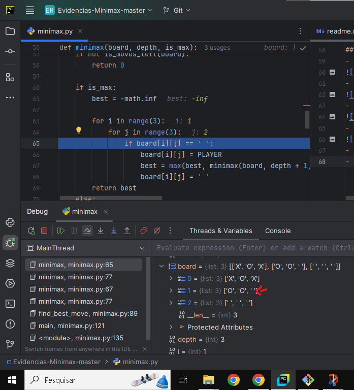

# Função minimax

## Primeira Iteração
Assumindo que o jogo começou com player executando na coordenada [1,1]

- Na primeira iteração é feita é avaliado o estado atual do quadro do jogo da velha

- Verificando se há algum vencedor ou empate, por se tratar de a primeira jogada nenhum if é entrado
- Depois é verificado se o é o jogador maximizer ou minimizer
- na como é chamado na primeira iteração, o minimizer é o jogador X, então caindo no else como a seguir

- é atribuído à variável de melhor jogada um número infinito positivo
- Depois é começado a iteração para ser preenchido as jogadas possíveis no estado atual do tabuleiro.

- Se caso a linha e coluna do tabuleiro estiver em branco é colocado na posição o oponente neste caso O
- Após isto como a posição [0,0] está preenchida, é iterado o segundo loop (j)
- É testado se está em branco, neste caso sim, então é colocado o oponente nela para simular uma possível jogada

- Após isto é atribuído o menor valor da comparação entre best, e a chamada da função minimax, só que agora simulando como se o maximizer fosse jogar
- Entrando na segunda iteração da função

## Segunda iteração
- é avaliado o estado do tabuleiro atualmente
- neste caso como ainda não há vencedores ou empate, os ifs seguintes não irão entrar

- Como está iteração da função é simulando o maximizer é entrado no primeiro if

- É atribuído o valor infinito negativo à variável best
- E após isto é iniciado um loop para preencher a jogada do maximizer

- Caso a posição esteja em branco, neste caso não, é iterado o segundo loop assim como na 1ª iteração
- Nesta iteração a jogada é feita na coordenada [0, 2]

- é colocado o X do player na posição, resultando nesta iteração o tabuleiro desta forma:

- Após isto é atribuído ao valor da variável best o maior valor entre o valor atual de best e o valor da próxima chamada da função minimax, simulando a jogada do oponente (O)

## Terceira iteração
- é avaliado o estado atual do tabuleiro novamente
- Como não há ainda um vencedor para esta rodada simulada, nenhum if será executado:

- Como esta iteração se trata de uma rodada simulada para o oponente(O), ele não é o maximizer e sim o minimizer
- Então caindo no else:

- é atribuído como melhor jogada o valor de infinito positivo, por se tratar do minimizer e pegar o menor valor
- Então é começado o loop para preenchimento da suposta próxima jogada de O

- Caso a posição esteja em branco é entrado no if para executar as instruções
- Como nesta iteração da função está a próxima posição que está vazia é a [1,0]
- Então loop será executado conforme a imagem a seguir do tabuleiro atualmente:

- É atribuído o valor do oponente (O) à posição, ficando da forma a seguir o tabuleiro simulado:

- Após isto é atribuído à variável best o menor valor da comparação entre valor atual de best e minimax da próxima possível jogada de X
- Indo então para a próxima iteração

## Quarta iteração
- É avaliado o estado atual do tabuleiro:

- Como neste momento ainda não há vencedores ou empate nenhum if irá entrar

- Como está sendo simulado a jogada do maximizer (X) é entrado no primeiro if:

- É atribuído ao valor de best o valor infinito negativo

- Posteriormente é iniciado o loop para estar preenchendo a próxima posição
- Como nesta iteração o próximo espaço vazio é na coordenada [1, 2], na imagem abaixo:

- Após a atribuição:

- E seguindo é atribuído assim como nas outras iterações, o valor à variável best o maior valor entre o atual de best e minmax da jogada simulada do oponente (O)

## Quinta iteração

- é novamente avaliado o estado atual do tabuleiro:

- Nesta iteração ainda não há vencedor ou empate, então não entrando em nenhum if a seguir
- Como esta iteração representa a simulação de jogada do oponente (O), o programa vai para o else na comparação

- é atribuído a variável best o número infinito positivo como na imagem acima
- e depois é iniciado novamente o loop da jogada do oponente que tenta minimizar

- Como nas outras iterações é procurado a próxima posição em branco para preencher e simular a jogada de O
- Nesta iteração, por exemplo, a próxima posição é a [2,0]

- Após a inserção o tabuleiro é atualizado e fica da seguinte maneira:

- e é atribuído à variável desta iteração best o menor valor entre a da própria variavél best e minimax da próxima jogada simulada de X

## Resumo
- O algoritmo fica neste processo até ter achado a melhor jogada no tabuleiro no momento após a primeira jogada.
- Importante ressaltar que após terminarem as chamadas recursivas do minimax é limpada a posição para que nossa iteração de seus loops internos sejam testadas as possíveis jogadas de preenchimento.
- E ponto importante é que na função find_best_move, ela testa dentro das opções que forem ainda válidas par jogar, as possíveis jogadas posteriores de cada jogador, sempre procurando maximizar os ganhos neste caso.
- No final após a primeira jogada o algoritmo prevê que a melhor posição é a [0,0]
- Como ainda é o começo do jogo, seu resultado ainda não surte muito efeito:
